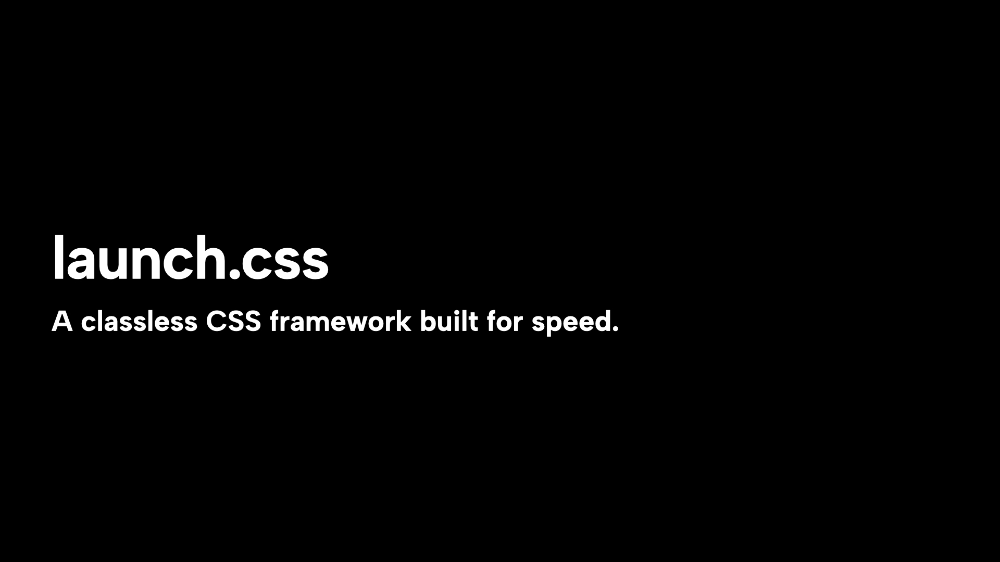

> A classless CSS framework built for speed. Style your website later—build it now.

launch.css is a minimalist, classless CSS framework focused on helping you launch projects quickly. It applies sensible styling to HTML elements without requiring class names, so you can build functional interfaces fast and style them later.

## Features

- **Zero Classes** - Style HTML elements directly, no need for complex class naming
- **Light/Dark Themes** - Built-in theme support with simple switching
- **Multiple Layouts** - Choose between website and dashboard layouts
- **Responsive** - Looks great on all devices with built-in breakpoints
- **Lightweight** - Only the essentials, no bloat
- **Modern** - Built with modern CSS features

## Installation

### NPM (recommended)

```bash
npx nypm add launch.css
```

Then import in your JavaScript:

```js
import "launch.css";
```

### CDN

Add the following to your HTML:

```html
<link rel="stylesheet" href="https://unpkg.com/launch.css" />
```

## Basic Usage

Just write semantic HTML and launch.css will style it for you. Add data attributes to control layout and theme:

```html
<!DOCTYPE html>
<html lang="en" data-theme="dark">
  <head>
    <meta charset="UTF-8" />
    <meta name="viewport" content="width=device-width, initial-scale=1.0" />
    <title>My launch.css Site</title>
  </head>
  <body data-layout="website">
    <header>
      <nav>
        <a href="/">My Site</a>
        <menu>
          <li><a href="/">Home</a></li>
          <li><a href="/about">About</a></li>
          <li><a href="/contact">Contact</a></li>
        </menu>
      </nav>
    </header>
    <main>
      <section>
        <h1>Welcome to my site</h1>
        <p>Built with launch.css - no classes needed!</p>
        <button>Click me</button>
      </section>
    </main>
  </body>
</html>
```

## Theme Switching

Toggle between light and dark themes with a simple attribute change:

```html
<html data-theme="light">
<!-- or -->
<html data-theme="dark">
```

## Layout Options

launch.css provides two main layout options:

```html
<!-- Standard website layout -->
<body data-layout="website">

<!-- Dashboard/app layout with fixed header -->
<body data-layout="dashboard">
```

## Examples

Check the `examples` directory for complete implementation examples:

- Website example with blog layout
- Dashboard/application layout

## Documentation

Visit [https://launch-css.dev](https://launch-css.dev) for complete documentation and examples.

## License

MIT © [Torsten Dittmann](https://github.com/TorstenDittmann)
